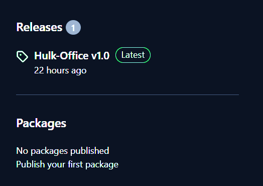
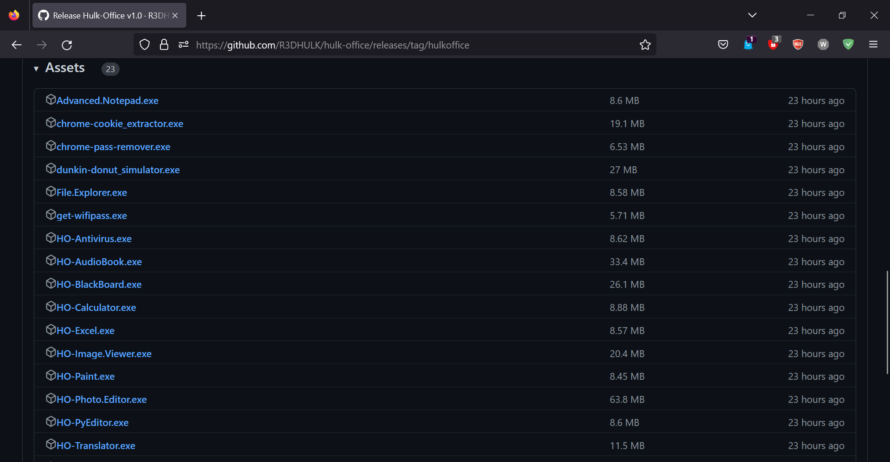
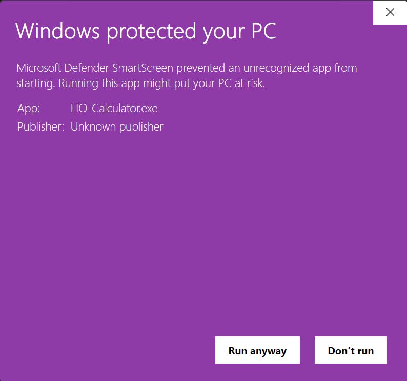

<h1><b> Hulk Office </b></h1>

## Microsoft office became so costly in these days. So I, [Sumalya Chatterjee](https://github.com/R3DHULK/), decided to make my own software like ms-office. Here's The Final Product...

#
  

#
<h2><i><b> Go To Releases Section Of My Repo 👇 </h2></i></b> 

 

#
<h2><i><b> Download And Install Which Software You Need 👇👇👇 </h2></i></b> 

 
#

<h2><i><b> This Pop Up Might Be A Problem 👇👇 </h2></i></b> 

 

<h2><i><b> But It Should Not Be A Problem. My Software Is Absolutely Virus Free. Just Click On More Info And Click On "Run Anyway" Into Your System 😊😊😊 </h2></i></b> 

 

# 

<h1><b>This Repo Just Contains Some Of My Ideas Together. In Future I'll Add More Tools and Softwares But All I Need Is Your Support 😊😊😊<b></h1>
  

